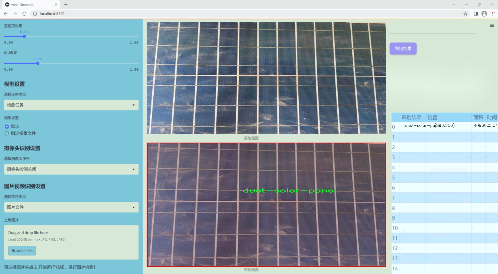
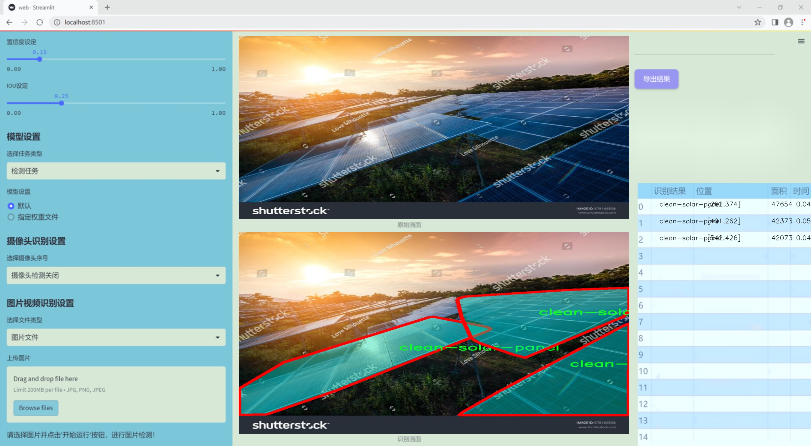
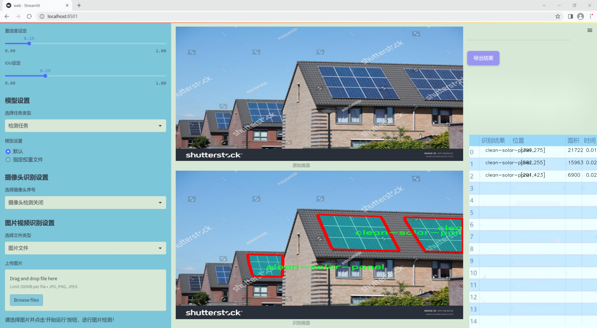
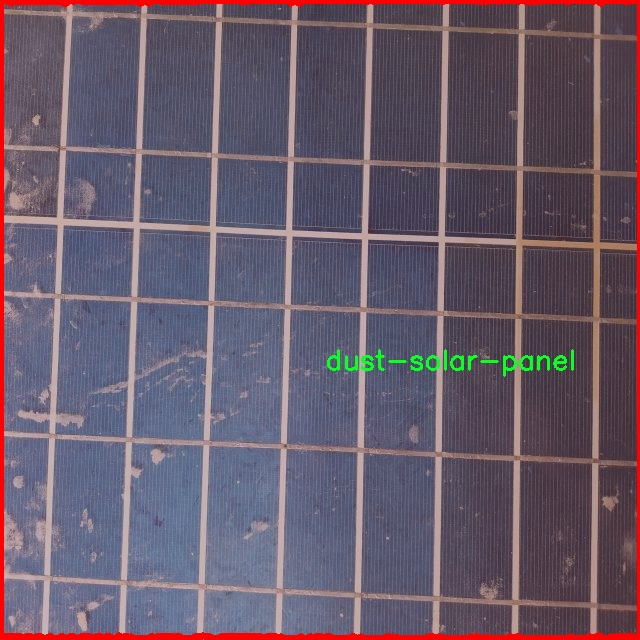
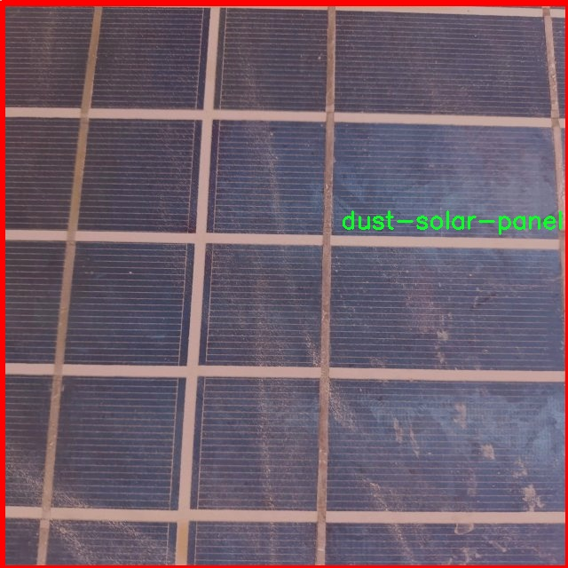
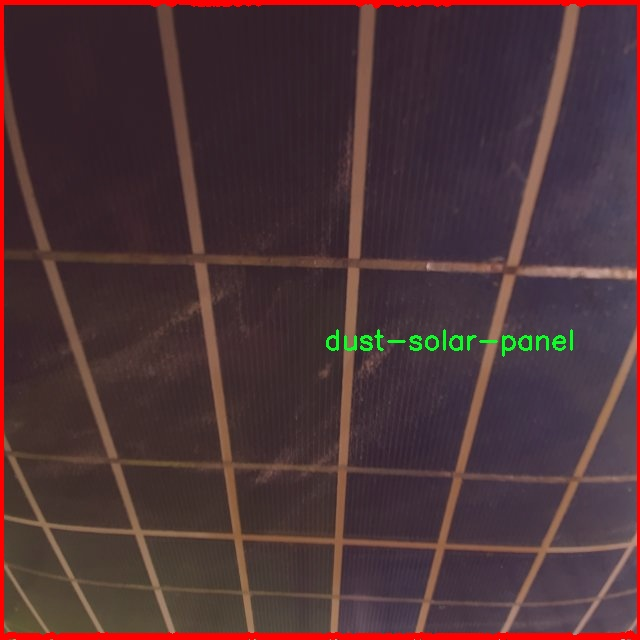
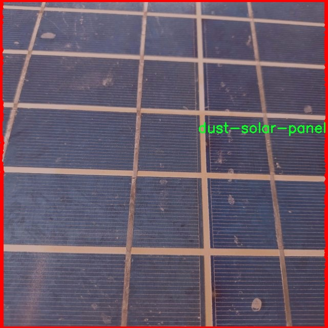
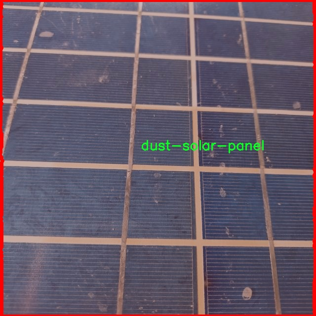

### 1.背景意义

研究背景与意义

随着全球对可再生能源的重视，太阳能作为一种清洁、可再生的能源形式，得到了广泛应用。然而，太阳能板在使用过程中容易受到灰尘和污垢的影响，这不仅降低了其光电转换效率，还可能导致设备的损坏和维护成本的增加。因此，及时有效地检测和清理太阳能板上的灰尘，成为了提升太阳能发电效率的重要环节。

在这一背景下，基于计算机视觉技术的自动化检测系统应运而生。近年来，深度学习技术的快速发展，尤其是目标检测算法的进步，为太阳能板灰尘检测提供了新的解决方案。YOLO（You Only Look Once）系列算法因其高效的实时检测能力，逐渐成为目标检测领域的主流选择。YOLOv11作为该系列的最新版本，具备更强的特征提取能力和更快的推理速度，适合在复杂环境中进行高效的灰尘检测。

本研究旨在基于改进的YOLOv11模型，构建一个高效的太阳能板灰尘检测系统。为此，我们使用了一个包含3100张图像的数据集，其中包括清洁和有灰尘的太阳能板两类。通过对数据集的深入分析和处理，我们希望能够提升模型在不同环境下的检测准确率和鲁棒性。此外，系统的实现将为太阳能发电行业提供一种智能化的解决方案，帮助用户实时监测太阳能板的清洁状态，从而优化维护策略，降低运营成本，提高发电效率。

综上所述，基于改进YOLOv11的太阳能板灰尘检测系统不仅具有重要的学术研究价值，也具有广泛的实际应用前景，为推动可再生能源的可持续发展贡献力量。

### 2.视频效果

[2.1 视频效果](https://www.bilibili.com/video/BV1AFk2YUESY/)

### 3.图片效果







##### [项目涉及的源码数据来源链接](https://kdocs.cn/l/cszuIiCKVNis)**

注意：本项目提供训练的数据集和训练教程,由于版本持续更新,暂不提供权重文件（best.pt）,请按照6.训练教程进行训练后实现上图演示的效果。

### 4.数据集信息

##### 4.1 本项目数据集类别数＆类别名

nc: 2
names: ['clean-solar-panel', 'dust-solar-panel']


该项目为【图像分割】数据集，请在【训练教程和Web端加载模型教程（第三步）】这一步的时候按照【图像分割】部分的教程来训练

##### 4.2 本项目数据集信息介绍

本项目数据集信息介绍

本项目所使用的数据集专注于太阳能板灰尘检测，旨在为改进YOLOv11模型提供高质量的训练数据。数据集包含两大类样本，分别为“clean-solar-panel”（干净的太阳能板）和“dust-solar-panel”（有灰尘的太阳能板），共计两个类别。这一分类设计不仅能够有效区分太阳能板的清洁状态，还能帮助模型学习在不同环境条件下的表现，提升其在实际应用中的准确性和鲁棒性。

在数据收集过程中，我们通过多种渠道获取了大量的图像数据，确保样本的多样性和代表性。数据集中的图像涵盖了不同光照条件、不同角度和不同类型的太阳能板，旨在模拟真实世界中可能遇到的各种情况。这种多样性不仅有助于提高模型的泛化能力，还能增强其在复杂环境下的适应性。

每个类别的样本都经过精心标注，确保每张图像中的太阳能板状态能够被准确识别。标注过程遵循严格的标准，以确保数据的质量和一致性。此外，为了提高模型的训练效果，我们还进行了数据增强处理，包括旋转、缩放、翻转等操作，以进一步丰富数据集，提升模型的学习能力。

通过对该数据集的深入分析和使用，我们期望能够显著提高YOLOv11在太阳能板灰尘检测任务中的性能，进而推动智能监测技术在可再生能源领域的应用。这一数据集不仅为研究人员提供了一个有价值的资源，也为未来的相关研究奠定了基础。











### 5.全套项目环境部署视频教程（零基础手把手教学）

[5.1 所需软件PyCharm和Anaconda安装教程（第一步）](https://www.bilibili.com/video/BV1BoC1YCEKi/?spm_id_from=333.999.0.0&vd_source=bc9aec86d164b67a7004b996143742dc)


[5.2 安装Python虚拟环境创建和依赖库安装视频教程（第二步）](https://www.bilibili.com/video/BV1ZoC1YCEBw?spm_id_from=333.788.videopod.sections&vd_source=bc9aec86d164b67a7004b996143742dc)

### 6.改进YOLOv11训练教程和Web_UI前端加载模型教程（零基础手把手教学）

[6.1 改进YOLOv11训练教程和Web_UI前端加载模型教程（第三步）](https://www.bilibili.com/video/BV1BoC1YCEhR?spm_id_from=333.788.videopod.sections&vd_source=bc9aec86d164b67a7004b996143742dc)


按照上面的训练视频教程链接加载项目提供的数据集，运行train.py即可开始训练



     Epoch   gpu_mem       box       obj       cls    labels  img_size
     1/200     20.8G   0.01576   0.01955  0.007536        22      1280: 100%|██████████| 849/849 [14:42<00:00,  1.04s/it]
               Class     Images     Labels          P          R     mAP@.5 mAP@.5:.95: 100%|██████████| 213/213 [01:14<00:00,  2.87it/s]
                 all       3395      17314      0.994      0.957      0.0957      0.0843

     Epoch   gpu_mem       box       obj       cls    labels  img_size
     2/200     20.8G   0.01578   0.01923  0.007006        22      1280: 100%|██████████| 849/849 [14:44<00:00,  1.04s/it]
               Class     Images     Labels          P          R     mAP@.5 mAP@.5:.95: 100%|██████████| 213/213 [01:12<00:00,  2.95it/s]
                 all       3395      17314      0.996      0.956      0.0957      0.0845

     Epoch   gpu_mem       box       obj       cls    labels  img_size
     3/200     20.8G   0.01561    0.0191  0.006895        27      1280: 100%|██████████| 849/849 [10:56<00:00,  1.29it/s]
               Class     Images     Labels          P          R     mAP@.5 mAP@.5:.95: 100%|███████   | 187/213 [00:52<00:00,  4.04it/s]
                 all       3395      17314      0.996      0.957      0.0957      0.0845


###### [项目数据集下载链接](https://kdocs.cn/l/cszuIiCKVNis)

### 7.原始YOLOv11算法讲解


###### YOLOv11改进方向

与YOLOv 10相比，YOLOv 11有了巨大的改进，包括但不限于：

  * 增强的模型结构：模型具有改进的模型结构，以获取图像处理并形成预测
  * GPU优化：这是现代ML模型的反映，GPU训练ML模型在速度和准确性上都更好。
  * 速度：YOLOv 11模型现在经过增强和GPU优化以用于训练。通过优化，这些模型比它们的前版本快得多。在速度上达到了25%的延迟减少！
  * 更少的参数：更少的参数允许更快的模型，但v11的准确性不受影响
  * 更具适应性：更多支持的任务YOLOv 11支持多种类型的任务、多种类型的对象和多种类型的图像。

###### YOLOv11功能介绍

Glenn Jocher和他的团队制作了一个令人敬畏的YOLOv 11迭代，并且在图像人工智能的各个方面都提供了YOLO。YOLOv 11有多种型号，包括：

  * 对象检测-在训练时检测图像中的对象
  * 图像分割-超越对象检测，分割出图像中的对象
  * 姿态检测-当用点和线训练时绘制一个人的姿势
  * 定向检测（OBB）：类似于对象检测，但包围盒可以旋转
  * 图像分类-在训练时对图像进行分类

使用Ultralytics Library，这些模型还可以进行优化，以：

  * 跟踪-可以跟踪对象的路径
  * 易于导出-库可以以不同的格式和目的导出
  * 多场景-您可以针对不同的对象和图像训练模型

此外，Ultralytics还推出了YOLOv 11的企业模型，该模型将于10月31日发布。这将与开源的YOLOv
11模型并行，但将拥有更大的专有Ultralytics数据集。YOLOv 11是“建立在过去的成功”的其他版本的之上。

###### YOLOv11模型介绍

YOLOv 11附带了边界框模型（无后缀），实例分割（-seg），姿态估计（-pose），定向边界框（-obb）和分类（-cls）。

这些也有不同的尺寸：纳米（n），小（s），中（m），大（l），超大（x）。


YOLOv11模型

###### YOLOv11与前版本对比

与YOLOv10和YOLOv8相比，YOLOv11在Ultralytics的任何帖子中都没有直接提到。所以我会收集所有的数据来比较它们。感谢Ultralytics：

**检测：**


YOLOv11检测统计


YOLOv10检测统计

其中，Nano的mAPval在v11上为39.5，v10上为38.5；Small为47.0 vs 46.3，Medium为51.5 vs
51.1，Large为53.4 vs 53.2，Extra Large为54.7vs
54.4。现在，这可能看起来像是一种增量增加，但小小数的增加可能会对ML模型产生很大影响。总体而言，YOLOv11以0.3
mAPval的优势追平或击败YOLOv10。

现在，我们必须看看速度。在延迟方面，Nano在v11上为1.55 , v10上为1.84，Small为2.46 v2.49，Medium为4.70
v4.74，Large为6.16 v7.28，Extra Large为11.31
v10.70。延迟越低越好。YOLOv11提供了一个非常低的延迟相比，除了特大做得相当差的前身。

总的来说，Nano模型是令人振奋的，速度更快，性能相当。Extra Large在性能上有很好的提升，但它的延迟非常糟糕。

**分割：**


YOLOV11 分割统计


YOLOV9 分割统计


YOLOV8 分割数据

总体而言，YOLOv 11上的分割模型在大型和超大型模型方面比上一代YOLOv 8和YOLOv 9做得更好。

YOLOv 9 Segmentation没有提供任何关于延迟的统计数据。比较YOLOv 11延迟和YOLOv 8延迟，发现YOLOv 11比YOLOv
8快得多。YOLOv 11将大量GPU集成到他们的模型中，因此期望他们的模型甚至比CPU测试的基准更快！

姿态估计：


YOLOV11姿态估计统计


YOLOV8姿态估计统计

YOLOv 11的mAP 50 -95统计量也逐渐优于先前的YOLOv 8（除大型外）。然而，在速度方面，YOLOv
11姿势可以最大限度地减少延迟。其中一些延迟指标是版本的1/4！通过对这些模型进行GPU训练优化，我可以看到指标比显示的要好得多。

**定向边界框：**


YOLOv11 OBB统计


YOLOv8 OBB统计

OBB统计数据在mAP
50上并不是很好，只有非常小的改进，在某种程度上小于检测中的微小改进。然而，从v8到v11的速度减半，这表明YOLOv11在速度上做了很多努力。

**最后，分类：**


YOLOv 11 CLS统计


YOLOv8 CLS统计

从v8到v11，准确性也有了微小的提高。然而，速度大幅上升，CPU速度更快的型号。


### 8.200+种全套改进YOLOV11创新点原理讲解

#### 8.1 200+种全套改进YOLOV11创新点原理讲解大全

由于篇幅限制，每个创新点的具体原理讲解就不全部展开，具体见下列网址中的改进模块对应项目的技术原理博客网址【Blog】（创新点均为模块化搭建，原理适配YOLOv5~YOLOv11等各种版本）

[改进模块技术原理博客【Blog】网址链接](https://gitee.com/qunmasj/good)


#### 8.2 精选部分改进YOLOV11创新点原理讲解

###### 这里节选部分改进创新点展开原理讲解(完整的改进原理见上图和[改进模块技术原理博客链接](https://gitee.com/qunmasj/good)【如果此小节的图加载失败可以通过CSDN或者Github搜索该博客的标题访问原始博客，原始博客图片显示正常】

### Gold-YOLO简介
YOLO再升级：华为诺亚提出Gold-YOLO，聚集-分发机制打造新SOTA
在过去的几年中，YOLO系列模型已经成为实时目标检测领域的领先方法。许多研究通过修改架构、增加数据和设计新的损失函数，将基线推向了更高的水平。然而以前的模型仍然存在信息融合问题，尽管特征金字塔网络（FPN）和路径聚合网络（PANet）已经在一定程度上缓解了这个问题。因此，本研究提出了一种先进的聚集和分发机制（GD机制），该机制通过卷积和自注意力操作实现。这种新设计的模型被称为Gold-YOLO，它提升了多尺度特征融合能力，在所有模型尺度上实现了延迟和准确性的理想平衡。此外，本文首次在YOLO系列中实现了MAE风格的预训练，使得YOLO系列模型能够从无监督预训练中受益。Gold-YOLO-N在COCO val2017数据集上实现了出色的39.9% AP，并在T4 GPU上实现了1030 FPS，超过了之前的SOTA模型YOLOv6-3.0-N，其FPS相似，但性能提升了2.4%。


#### Gold-YOLO


YOLO系列的中间层结构采用了传统的FPN结构，其中包含多个分支用于多尺度特征融合。然而，它只充分融合来自相邻级别的特征，对于其他层次的信息只能间接地进行“递归”获取。

传统的FPN结构在信息传输过程中存在丢失大量信息的问题。这是因为层之间的信息交互仅限于中间层选择的信息，未被选择的信息在传输过程中被丢弃。这种情况导致某个Level的信息只能充分辅助相邻层，而对其他全局层的帮助较弱。因此，整体上信息融合的有效性可能受到限制。
为了避免在传输过程中丢失信息，本文采用了一种新颖的“聚集和分发”机制（GD），放弃了原始的递归方法。该机制使用一个统一的模块来收集和融合所有Level的信息，并将其分发到不同的Level。通过这种方式，作者不仅避免了传统FPN结构固有的信息丢失问题，还增强了中间层的部分信息融合能力，而且并没有显著增加延迟。


# 8.低阶聚合和分发分支 Low-stage gather-and-distribute branch
从主干网络中选择输出的B2、B3、B4、B5特征进行融合，以获取保留小目标信息的高分辨率特征。


低阶特征对齐模块 (Low-stage feature alignment module)： 在低阶特征对齐模块（Low-FAM）中，采用平均池化（AvgPool）操作对输入特征进行下采样，以实现统一的大小。通过将特征调整为组中最小的特征大小（ R B 4 = 1 / 4 R ） （R_{B4} = 1/4R）（R 
B4 =1/4R），我们得到对齐后的特征F a l i g n F_{align}F align 。低阶特征对齐技术确保了信息的高效聚合，同时通过变换器模块来最小化后续处理的计算复杂性。其中选择 R B 4 R_{B4}R B4 作为特征对齐的目标大小主要基于保留更多的低层信息的同时不会带来较大的计算延迟。
低阶信息融合模块(Low-stage information fusion module)： 低阶信息融合模块（Low-IFM）设计包括多层重新参数化卷积块（RepBlock）和分裂操作。具体而言，RepBlock以F a l i g n ( c h a n n e l = s u m ( C B 2 ， C B 3 ， C B 4 ， C B 5 ) ) F_{align} (channel= sum(C_{B2}，C_{B3}，C_{B4}，C_{B5}))F align (channel=sum(C B2 ，C B3 ，C B4 ，C B5 )作为输入，并生成F f u s e ( c h a n n e l = C B 4 + C B 5 ) F_{fuse} (channel= C_{B4} + C_{B5})F fuse (channel=C B4 +C B5 )。其中中间通道是一个可调整的值（例如256），以适应不同的模型大小。由RepBlock生成的特征随后在通道维度上分裂为F i n j P 3 Finj_P3Finj P 3和F i n j P 4 Finj_P4Finj P 4，然后与不同级别的特征进行融合。


# 8.高阶聚合和分发分支 High-stage gather-and-distribute branch
高级全局特征对齐模块（High-GD）将由低级全局特征对齐模块（Low-GD）生成的特征{P3, P4, P5}进行融合。


高级特征对齐模块(High-stage feature alignment module)： High-FAM由avgpool组成，用于将输入特征的维度减小到统一的尺寸。具体而言，当输入特征的尺寸为{R P 3 R_{P3}R P3 , R P 4 R_{P4}R P4 , R P 5 R_{P 5}R P5 }时，avgpool将特征尺寸减小到该特征组中最小的尺寸（R P 5 R_{P5}R P5  = 1/8R）。由于transformer模块提取了高层次的信息，池化操作有助于信息聚合，同时降低了transformer模块后续步骤的计算需求。

Transformer融合模块由多个堆叠的transformer组成，transformer块的数量为L。每个transformer块包括一个多头注意力块、一个前馈网络（FFN）和残差连接。采用与LeViT相同的设置来配置多头注意力块，使用16个通道作为键K和查询Q的头维度，32个通道作为值V的头维度。为了加速推理过程，将层归一化操作替换为批归一化，并将所有的GELU激活函数替换为ReLU。为了增强变换器块的局部连接，在两个1x1卷积层之间添加了一个深度卷积层。同时，将FFN的扩展因子设置为2，以在速度和计算成本之间取得平衡。

信息注入模块(Information injection module)： 高级全局特征对齐模块（High-GD）中的信息注入模块与低级全局特征对齐模块（Low-GD）中的相同。在高级阶段，局部特征（Flocal）等于Pi，因此公式如下所示：


### 增强的跨层信息流动 Enhanced cross-layer information flow
为了进一步提升性能，从YOLOv11 中的PAFPN模块中得到启发，引入了Inject-LAF模块。该模块是注入模块的增强版，包括了一个轻量级相邻层融合（LAF）模块，该模块被添加到注入模块的输入位置。为了在速度和准确性之间取得平衡，设计了两个LAF模型：LAF低级模型和LAF高级模型，分别用于低级注入（合并相邻两层的特征）和高级注入（合并相邻一层的特征）。它们的结构如图5(b)所示。为了确保来自不同层级的特征图与目标大小对齐，在实现中的两个LAF模型仅使用了三个操作符：双线性插值（上采样过小的特征）、平均池化（下采样过大的特征）和1x1卷积（调整与目标通道不同的特征）。模型中的LAF模块与信息注入模块的结合有效地平衡了准确性和速度之间的关系。通过使用简化的操作，能够增加不同层级之间的信息流路径数量，从而提高性能而不显著增加延迟。


### 9.系统功能展示

图9.1.系统支持检测结果表格显示

  图9.2.系统支持置信度和IOU阈值手动调节

  图9.3.系统支持自定义加载权重文件best.pt(需要你通过步骤5中训练获得)

  图9.4.系统支持摄像头实时识别

  图9.5.系统支持图片识别

  图9.6.系统支持视频识别

  图9.7.系统支持识别结果文件自动保存

  图9.8.系统支持Excel导出检测结果数据


### 10. YOLOv11核心改进源码讲解

#### 10.1 dyhead_prune.py

以下是对给定代码的核心部分进行分析和注释，保留了最重要的类和方法，并添加了详细的中文注释。

```python
import torch
import torch.nn as nn
import torch.nn.functional as F

# 定义一个函数，用于确保输入的值可以被指定的除数整除
def _make_divisible(v, divisor, min_value=None):
    if min_value is None:
        min_value = divisor
    new_v = max(min_value, int(v + divisor / 2) // divisor * divisor)
    # 确保向下取整不会减少超过10%
    if new_v < 0.9 * v:
        new_v += divisor
    return new_v

# Swish激活函数
class swish(nn.Module):
    def forward(self, x):
        return x * torch.sigmoid(x)

# H-Swish激活函数
class h_swish(nn.Module):
    def __init__(self, inplace=False):
        super(h_swish, self).__init__()
        self.inplace = inplace

    def forward(self, x):
        return x * F.relu6(x + 3.0, inplace=self.inplace) / 6.0

# H-Sigmoid激活函数
class h_sigmoid(nn.Module):
    def __init__(self, inplace=True, h_max=1):
        super(h_sigmoid, self).__init__()
        self.relu = nn.ReLU6(inplace=inplace)
        self.h_max = h_max

    def forward(self, x):
        return self.relu(x + 3) * self.h_max / 6

# 动态ReLU模块
class DyReLU(nn.Module):
    def __init__(self, inp, reduction=4, lambda_a=1.0, K2=True, use_bias=True, use_spatial=False,
                 init_a=[1.0, 0.0], init_b=[0.0, 0.0]):
        super(DyReLU, self).__init__()
        self.oup = inp  # 输出通道数
        self.lambda_a = lambda_a * 2  # 动态调整参数
        self.K2 = K2  # 是否使用K2
        self.avg_pool = nn.AdaptiveAvgPool2d(1)  # 自适应平均池化

        # 确定压缩比
        squeeze = inp // reduction if reduction == 4 else _make_divisible(inp // reduction, 4)

        # 定义全连接层
        self.fc = nn.Sequential(
            nn.Linear(inp, squeeze),
            nn.ReLU(inplace=True),
            nn.Linear(squeeze, self.oup * (4 if K2 else 2)),
            h_sigmoid()
        )
        # 如果使用空间注意力，则定义相应的卷积层
        self.spa = nn.Sequential(
            nn.Conv2d(inp, 1, kernel_size=1),
            nn.BatchNorm2d(1),
        ) if use_spatial else None

    def forward(self, x):
        # 处理输入
        x_in = x[0] if isinstance(x, list) else x
        x_out = x[1] if isinstance(x, list) else x
        b, c, h, w = x_in.size()  # 获取输入的形状
        y = self.avg_pool(x_in).view(b, c)  # 自适应平均池化
        y = self.fc(y).view(b, self.oup * (4 if self.K2 else 2), 1, 1)  # 通过全连接层

        # 根据不同的exp值计算输出
        if self.K2:
            a1, b1, a2, b2 = torch.split(y, self.oup, dim=1)
            a1 = (a1 - 0.5) * self.lambda_a + 1.0
            a2 = (a2 - 0.5) * self.lambda_a
            b1 = b1 - 0.5
            b2 = b2 - 0.5
            out = torch.max(x_out * a1 + b1, x_out * a2 + b2)
        else:
            a1, b1 = torch.split(y, self.oup, dim=1)
            a1 = (a1 - 0.5) * self.lambda_a + 1.0
            b1 = b1 - 0.5
            out = x_out * a1 + b1

        # 如果使用空间注意力，则进行相应的计算
        if self.spa:
            ys = self.spa(x_in).view(b, -1)
            ys = F.softmax(ys, dim=1).view(b, 1, h, w) * h * w
            ys = F.hardtanh(ys, 0, 3) / 3
            out = out * ys

        return out

# 动态卷积模块
class DyDCNv2(nn.Module):
    def __init__(self, in_channels, out_channels, stride=1, norm_cfg=dict(type='GN', num_groups=16, requires_grad=True)):
        super().__init__()
        self.with_norm = norm_cfg is not None  # 是否使用归一化
        bias = not self.with_norm  # 如果使用归一化，则不使用偏置
        self.conv = ModulatedDeformConv2d(in_channels, out_channels, 3, stride=stride, padding=1, bias=bias)  # 定义可调变形卷积
        if self.with_norm:
            self.norm = build_norm_layer(norm_cfg, out_channels)[1]  # 构建归一化层

    def forward(self, x, offset, mask):
        """前向传播函数"""
        x = self.conv(x.contiguous(), offset, mask)  # 进行卷积操作
        if self.with_norm:
            x = self.norm(x)  # 进行归一化
        return x

# 动态头模块
class DyHeadBlock_Prune(nn.Module):
    def __init__(self, in_channels, norm_type='GN', zero_init_offset=True, act_cfg=dict(type='HSigmoid', bias=3.0, divisor=6.0)):
        super().__init__()
        self.zero_init_offset = zero_init_offset  # 是否初始化偏移为零
        self.offset_and_mask_dim = 3 * 3 * 3  # 偏移和掩码的维度
        self.offset_dim = 2 * 3 * 3  # 偏移的维度

        # 根据归一化类型选择归一化配置
        norm_dict = dict(type='GN', num_groups=16, requires_grad=True) if norm_type == 'GN' else dict(type='BN', requires_grad=True)

        # 定义不同尺度的动态卷积
        self.spatial_conv_high = DyDCNv2(in_channels, in_channels, norm_cfg=norm_dict)
        self.spatial_conv_mid = DyDCNv2(in_channels, in_channels)
        self.spatial_conv_low = DyDCNv2(in_channels, in_channels, stride=2)
        self.spatial_conv_offset = nn.Conv2d(in_channels, self.offset_and_mask_dim, 3, padding=1)  # 偏移卷积
        self.scale_attn_module = nn.Sequential(
            nn.AdaptiveAvgPool2d(1), 
            nn.Conv2d(in_channels, 1, 1),
            nn.ReLU(inplace=True), 
            build_activation_layer(act_cfg)
        )  # 尺度注意力模块
        self.task_attn_module = DyReLU(in_channels)  # 任务注意力模块
        self._init_weights()  # 初始化权重

    def _init_weights(self):
        for m in self.modules():
            if isinstance(m, nn.Conv2d):
                normal_init(m, 0, 0.01)  # 正态初始化卷积层
        if self.zero_init_offset:
            constant_init(self.spatial_conv_offset, 0)  # 偏移初始化为零

    def forward(self, x, level):
        """前向传播函数"""
        # 计算DCNv2的偏移和掩码
        offset_and_mask = self.spatial_conv_offset(x[level])
        offset = offset_and_mask[:, :self.offset_dim, :, :]  # 提取偏移
        mask = offset_and_mask[:, self.offset_dim:, :, :].sigmoid()  # 提取掩码并应用sigmoid

        mid_feat = self.spatial_conv_mid(x[level], offset, mask)  # 中间特征卷积
        sum_feat = mid_feat * self.scale_attn_module(mid_feat)  # 计算加权特征
        summed_levels = 1  # 计数加权层数

        # 处理低层特征
        if level > 0:
            low_feat = self.spatial_conv_low(x[level - 1], offset, mask)
            sum_feat += low_feat * self.scale_attn_module(low_feat)
            summed_levels += 1

        # 处理高层特征
        if level < len(x) - 1:
            high_feat = F.interpolate(
                self.spatial_conv_high(x[level + 1], offset, mask),
                size=x[level].shape[-2:],
                mode='bilinear',
                align_corners=True
            )
            sum_feat += high_feat * self.scale_attn_module(high_feat)
            summed_levels += 1

        return self.task_attn_module(sum_feat / summed_levels)  # 返回最终的任务注意力
```

### 代码分析
1. **激活函数**：定义了几种激活函数（Swish, H-Swish, H-Sigmoid），这些函数在深度学习中用于引入非线性。
2. **DyReLU**：动态ReLU模块，能够根据输入特征动态调整输出，使用了自适应平均池化和全连接层。
3. **DyDCNv2**：动态卷积模块，结合了可调变形卷积和归一化层，用于处理特征图。
4. **DyHeadBlock_Prune**：动态头模块，集成了多种注意力机制，通过不同尺度的卷积和动态调整来增强特征表示。

这些模块和函数构成了一个动态卷积神经网络的核心部分，能够有效地处理多尺度特征并进行动态调整。

这个文件 `dyhead_prune.py` 是一个用于实现动态头部（Dynamic Head）模块的 PyTorch 代码，主要涉及到动态卷积和注意力机制。代码中定义了多个类和函数，以下是对其主要内容的讲解。

首先，导入了必要的库，包括 PyTorch 的核心库和一些特定的模块，如 `mmcv` 和 `mmengine`，这些库提供了构建激活层、归一化层以及一些初始化方法的功能。

接下来，定义了一个辅助函数 `_make_divisible`，用于确保某个值是可被指定的除数整除的，同时还会确保在向下取整时不会减少超过 10%。这个函数在构建网络时可以用来调整通道数等参数。

接着，定义了几个激活函数的类，包括 `swish`、`h_swish` 和 `h_sigmoid`。这些类都是继承自 `nn.Module`，并实现了 `forward` 方法，以便在前向传播中使用。这些激活函数在深度学习中常用于提高模型的非线性表达能力。

然后，定义了 `DyReLU` 类，这是一个动态激活函数模块。它根据输入特征的统计信息动态调整激活函数的参数。这个类的构造函数中定义了输入通道数、缩减比例、初始化参数等，并构建了一个全连接层用于计算激活参数。`forward` 方法中则实现了根据输入特征计算输出的逻辑，包括可选的空间注意力机制。

接下来，定义了 `DyDCNv2` 类，这是一个带有归一化层的调制变形卷积模块。它使用 `ModulatedDeformConv2d` 进行卷积操作，并在前向传播中应用归一化层。这个模块在动态头部中用于计算特征图的偏移和掩码。

然后，定义了 `DyHeadBlock_Prune` 类，这是动态头部的核心模块，结合了多种注意力机制。构造函数中初始化了多个卷积层和注意力模块，包括空间卷积和任务注意力模块。`_init_weights` 方法用于初始化卷积层的权重。`forward` 方法中实现了根据输入特征计算偏移和掩码，并结合不同层次的特征进行融合，最终通过任务注意力模块生成输出。

整体来看，这个文件实现了一个复杂的动态头部结构，利用动态卷积和注意力机制来增强特征提取能力，适用于目标检测等计算机视觉任务。通过对输入特征的动态调整和多层次特征的融合，能够提高模型的表现和适应性。

#### 10.2 SMPConv.py

以下是代码中最核心的部分，并附上详细的中文注释：

```python
import torch
import torch.nn as nn
import torch.nn.functional as F

# 定义一个函数，用于生成相对位置的坐标
def rel_pos(kernel_size):
    # 生成从 -1 到 1 的线性空间，步数为 kernel_size
    tensors = [torch.linspace(-1, 1, steps=kernel_size) for _ in range(2)]
    # 创建网格坐标
    kernel_coord = torch.stack(torch.meshgrid(*tensors), dim=-0)
    kernel_coord = kernel_coord.unsqueeze(0)  # 增加一个维度
    return kernel_coord

# 定义一个自定义卷积层 SMPConv
class SMPConv(nn.Module):
    def __init__(self, planes, kernel_size, n_points, stride, padding, groups):
        super().__init__()

        self.planes = planes  # 输出通道数
        self.kernel_size = kernel_size  # 卷积核大小
        self.n_points = n_points  # 采样点数
        self.init_radius = 2 * (2/kernel_size)  # 初始化半径

        # 生成卷积核坐标
        kernel_coord = rel_pos(kernel_size)
        self.register_buffer('kernel_coord', kernel_coord)  # 注册为持久缓冲区

        # 初始化权重坐标
        weight_coord = torch.empty(1, n_points, 2)
        nn.init.trunc_normal_(weight_coord, std=0.2, a=-1., b=1.)  # 使用截断正态分布初始化
        self.weight_coord = nn.Parameter(weight_coord)  # 将其作为可学习参数

        # 初始化半径
        self.radius = nn.Parameter(torch.empty(1, n_points).unsqueeze(-1).unsqueeze(-1))
        self.radius.data.fill_(value=self.init_radius)  # 填充初始值

        # 初始化权重
        weights = torch.empty(1, planes, n_points)
        nn.init.trunc_normal_(weights, std=.02)  # 使用截断正态分布初始化
        self.weights = nn.Parameter(weights)  # 将其作为可学习参数

    def forward(self, x):
        # 生成卷积核并进行前向传播
        kernels = self.make_kernels().unsqueeze(1)  # 生成卷积核
        x = x.contiguous()  # 确保输入是连续的
        kernels = kernels.contiguous()  # 确保卷积核是连续的

        # 根据输入数据类型选择合适的卷积实现
        if x.dtype == torch.float32:
            x = _DepthWiseConv2dImplicitGEMMFP32.apply(x, kernels)  # FP32 卷积
        elif x.dtype == torch.float16:
            x = _DepthWiseConv2dImplicitGEMMFP16.apply(x, kernels)  # FP16 卷积
        else:
            raise TypeError("Only support fp32 and fp16, get {}".format(x.dtype))  # 抛出不支持的类型错误
        return x        

    def make_kernels(self):
        # 计算卷积核
        diff = self.weight_coord.unsqueeze(-2) - self.kernel_coord.reshape(1, 2, -1).transpose(1, 2)  # 计算坐标差
        diff = diff.transpose(2, 3).reshape(1, self.n_points, 2, self.kernel_size, self.kernel_size)  # 重塑形状
        diff = F.relu(1 - torch.sum(torch.abs(diff), dim=2) / self.radius)  # 计算差值并应用 ReLU 激活
        
        # 计算最终的卷积核
        kernels = torch.matmul(self.weights, diff.reshape(1, self.n_points, -1))  # 加权求和
        kernels = kernels.reshape(1, self.planes, *self.kernel_coord.shape[2:])  # 重塑形状
        kernels = kernels.squeeze(0)  # 去掉多余的维度
        kernels = torch.flip(kernels.permute(0, 2, 1), dims=(1,))  # 反转维度
        return kernels

# 定义一个卷积块 SMPCNN
class SMPCNN(nn.Module):
    def __init__(self, in_channels, out_channels, kernel_size, stride, groups, n_points=None):
        super().__init__()
        self.smp = SMPConv(in_channels, kernel_size, n_points, stride, kernel_size // 2, groups)  # 自定义卷积层
        self.small_conv = nn.Conv2d(in_channels, out_channels, kernel_size=5, stride=stride, padding=2, groups=groups)  # 小卷积层

    def forward(self, inputs):
        # 前向传播
        out = self.smp(inputs)  # 通过自定义卷积层
        out += self.small_conv(inputs)  # 添加小卷积层的输出
        return out

# 定义一个块 SMPBlock
class SMPBlock(nn.Module):
    def __init__(self, in_channels, dw_channels, lk_size, drop_path):
        super().__init__()
        self.pw1 = nn.Sequential(nn.Conv2d(in_channels, dw_channels, kernel_size=1), nn.BatchNorm2d(dw_channels), nn.ReLU())  # 1x1 卷积
        self.large_kernel = SMPCNN(dw_channels, dw_channels, lk_size, stride=1, groups=dw_channels)  # 大卷积层
        self.pw2 = nn.Conv2d(dw_channels, in_channels, kernel_size=1)  # 1x1 卷积

    def forward(self, x):
        # 前向传播
        out = self.pw1(x)  # 通过第一个卷积层
        out = self.large_kernel(out)  # 通过大卷积层
        out = self.pw2(out)  # 通过第二个卷积层
        return x + out  # 残差连接
```

### 代码说明
1. **rel_pos函数**：生成卷积核的相对位置坐标，用于后续的卷积操作。
2. **SMPConv类**：自定义卷积层，支持动态生成卷积核，适用于深度学习模型中的卷积操作。
3. **SMPCNN类**：结合自定义卷积层和小卷积层的网络模块，能够处理不同大小的卷积核。
4. **SMPBlock类**：包含多个卷积层和残差连接的块，用于构建更复杂的网络结构。

以上代码是实现自定义卷积层和网络模块的核心部分，能够用于深度学习中的特征提取和处理。

这个程序文件 `SMPConv.py` 实现了一种新的卷积层，称为 `SMPConv`，以及与之相关的多个模块和类，主要用于深度学习中的卷积神经网络（CNN）。以下是对代码的详细说明。

首先，文件导入了一些必要的库，包括 PyTorch 的核心模块 `torch` 和 `torch.nn`，以及一些功能性模块，如 `torch.nn.functional` 和 `torch.utils.checkpoint`。还尝试导入了自定义的深度可分离卷积实现 `_DepthWiseConv2dImplicitGEMMFP16` 和 `_DepthWiseConv2dImplicitGEMMFP32`，用于加速计算。

接下来，定义了一个函数 `rel_pos`，该函数用于生成相对位置的坐标张量，输入为卷积核的大小。这个函数利用 `torch.linspace` 和 `torch.meshgrid` 创建一个二维坐标网格。

`SMPConv` 类是核心卷积模块，继承自 `nn.Module`。在初始化方法中，定义了多个参数，包括输出通道数、卷积核大小、点数、步幅和填充。使用 `rel_pos` 函数生成卷积核的坐标，并初始化权重坐标和半径。权重通过截断正态分布初始化。

`forward` 方法实现了前向传播，首先调用 `make_kernels` 方法生成卷积核，然后根据输入数据的类型（FP32 或 FP16）选择合适的深度可分离卷积实现进行计算。

`make_kernels` 方法生成卷积核的具体实现。它计算权重坐标与卷积核坐标之间的差异，并通过 ReLU 激活函数进行处理，最后将这些差异与权重结合生成最终的卷积核。

`radius_clip` 方法用于限制半径的范围，确保其在指定的最小值和最大值之间。

接下来，定义了一些辅助函数，如 `get_conv2d`、`get_bn` 和 `conv_bn`，这些函数用于创建卷积层和批归一化层的组合，支持自定义参数。

`SMPCNN` 类是一个组合卷积网络，使用 `SMPConv` 和一个小卷积核进行特征提取。它在前向传播中将两者的输出相加。

`SMPCNN_ConvFFN` 类实现了一个前馈网络（Feed Forward Network），包括两个逐点卷积层和一个非线性激活函数（GELU），并在前向传播中使用了残差连接。

最后，`SMPBlock` 类实现了一个更复杂的模块，结合了逐点卷积、SMP 卷积和残差连接，支持 DropPath 技术以增强模型的鲁棒性。

整体来看，这个文件实现了一种新的卷积操作，结合了位置编码和动态权重生成，旨在提高卷积神经网络的表现和灵活性。

#### 10.3 ui.py

以下是经过简化和注释的核心代码部分：

```python
import sys
import subprocess

def run_script(script_path):
    """
    使用当前 Python 环境运行指定的脚本。

    Args:
        script_path (str): 要运行的脚本路径

    Returns:
        None
    """
    # 获取当前 Python 解释器的路径
    python_path = sys.executable

    # 构建运行命令，使用 streamlit 运行指定的脚本
    command = f'"{python_path}" -m streamlit run "{script_path}"'

    # 执行命令，并等待其完成
    result = subprocess.run(command, shell=True)
    
    # 检查命令执行的返回码，如果不为0则表示出错
    if result.returncode != 0:
        print("脚本运行出错。")

# 主程序入口
if __name__ == "__main__":
    # 指定要运行的脚本路径
    script_path = "web.py"  # 这里可以直接指定脚本名，假设在当前目录下

    # 调用函数运行脚本
    run_script(script_path)
```

### 代码注释说明：
1. **导入模块**：
   - `sys`：用于获取当前 Python 解释器的路径。
   - `subprocess`：用于执行外部命令。

2. **`run_script` 函数**：
   - 接收一个参数 `script_path`，表示要运行的 Python 脚本的路径。
   - 使用 `sys.executable` 获取当前 Python 解释器的路径。
   - 构建一个命令字符串，用于调用 `streamlit` 运行指定的脚本。
   - 使用 `subprocess.run` 执行构建的命令，并等待其完成。
   - 检查命令的返回码，如果返回码不为0，表示脚本运行出错，打印错误信息。

3. **主程序入口**：
   - 使用 `if __name__ == "__main__":` 确保只有在直接运行该脚本时才会执行以下代码。
   - 指定要运行的脚本路径（在此示例中为 `"web.py"`）。
   - 调用 `run_script` 函数来执行指定的脚本。

这个程序文件名为 `ui.py`，主要功能是通过当前的 Python 环境来运行一个指定的脚本，具体是使用 Streamlit 框架来启动一个 Web 应用。

首先，程序导入了必要的模块，包括 `sys`、`os` 和 `subprocess`。其中，`sys` 模块用于访问与 Python 解释器相关的变量和函数，`os` 模块提供了与操作系统交互的功能，而 `subprocess` 模块则用于创建新进程、连接到它们的输入/输出/错误管道，并获取它们的返回码。此外，程序还从 `QtFusion.path` 模块中导入了 `abs_path` 函数，用于获取文件的绝对路径。

接下来，定义了一个名为 `run_script` 的函数，该函数接受一个参数 `script_path`，表示要运行的脚本的路径。在函数内部，首先获取当前 Python 解释器的路径，存储在 `python_path` 变量中。然后，构建一个命令字符串 `command`，该命令使用当前的 Python 解释器和 Streamlit 模块来运行指定的脚本。具体的命令格式为 `"{python_path}" -m streamlit run "{script_path}"`。

使用 `subprocess.run` 方法执行构建好的命令，并将 `shell` 参数设置为 `True`，这意味着命令将在一个新的 shell 中执行。执行后，检查返回码 `result.returncode`，如果返回码不为 0，表示脚本运行出错，程序会打印出相应的错误信息。

在文件的最后部分，使用 `if __name__ == "__main__":` 语句来确保当该文件作为主程序运行时，以下代码才会被执行。这里指定了要运行的脚本路径 `script_path`，通过调用 `abs_path` 函数获取 `web.py` 的绝对路径。最后，调用 `run_script` 函数来运行指定的脚本。

总的来说，这个程序的核心功能是方便地启动一个 Streamlit Web 应用，简化了用户手动运行脚本的过程。

#### 10.4 FreqFusion.py

以下是经过简化和注释的核心代码部分，主要包括 `FreqFusion` 类及其相关方法。该类实现了一种频率感知的特征融合机制，用于密集图像预测。

```python
import torch
import torch.nn as nn
import torch.nn.functional as F

class FreqFusion(nn.Module):
    def __init__(self, channels, scale_factor=1, lowpass_kernel=5, highpass_kernel=3, **kwargs):
        super().__init__()
        hr_channels, lr_channels = channels
        self.scale_factor = scale_factor
        self.lowpass_kernel = lowpass_kernel
        self.highpass_kernel = highpass_kernel
        
        # 压缩高分辨率和低分辨率特征通道
        self.compressed_channels = (hr_channels + lr_channels) // 8
        self.hr_channel_compressor = nn.Conv2d(hr_channels, self.compressed_channels, 1)
        self.lr_channel_compressor = nn.Conv2d(lr_channels, self.compressed_channels, 1)

        # 内容编码器，用于生成低通和高通滤波器
        self.content_encoder = nn.Conv2d(
            self.compressed_channels,
            lowpass_kernel ** 2,
            kernel_size=3,
            padding=1
        )
        self.content_encoder2 = nn.Conv2d(
            self.compressed_channels,
            highpass_kernel ** 2,
            kernel_size=3,
            padding=1
        )

    def kernel_normalizer(self, mask, kernel):
        """
        归一化卷积核，使其和为1。
        """
        mask = F.softmax(mask, dim=1)  # 使用softmax进行归一化
        mask = mask.view(-1, kernel, kernel)  # 调整形状
        mask /= mask.sum(dim=(-1, -2), keepdims=True)  # 归一化
        return mask

    def forward(self, x):
        """
        前向传播函数，接收高分辨率和低分辨率特征并进行融合。
        """
        hr_feat, lr_feat = x  # 拆分输入特征
        compressed_hr_feat = self.hr_channel_compressor(hr_feat)  # 压缩高分辨率特征
        compressed_lr_feat = self.lr_channel_compressor(lr_feat)  # 压缩低分辨率特征

        # 生成低通和高通滤波器
        mask_lr = self.content_encoder(compressed_lr_feat)  # 低通滤波器
        mask_hr = self.content_encoder2(compressed_hr_feat)  # 高通滤波器

        # 归一化滤波器
        mask_lr = self.kernel_normalizer(mask_lr, self.lowpass_kernel)
        mask_hr = self.kernel_normalizer(mask_hr, self.highpass_kernel)

        # 使用卷积和滤波器进行特征融合
        lr_feat = F.conv2d(lr_feat, mask_lr)  # 应用低通滤波器
        hr_feat = F.conv2d(hr_feat, mask_hr)  # 应用高通滤波器

        return hr_feat + lr_feat  # 返回融合后的特征
```

### 代码说明：
1. **导入库**：引入了 PyTorch 相关的库，用于构建神经网络和处理张量。
2. **FreqFusion 类**：这是一个继承自 `nn.Module` 的类，主要用于实现频率感知特征融合。
   - **初始化方法**：接收输入通道数、缩放因子和卷积核大小等参数，初始化特征压缩和内容编码器。
   - **kernel_normalizer 方法**：用于归一化卷积核，使其和为1，确保在特征融合时不会引入额外的偏差。
   - **forward 方法**：实现前向传播，接收高分辨率和低分辨率特征，生成低通和高通滤波器，并通过卷积操作进行特征融合，最后返回融合后的特征。

通过这些核心部分，`FreqFusion` 类能够有效地融合不同频率的特征，以提高图像预测的准确性。

这个程序文件 `FreqFusion.py` 实现了一种名为“频率感知特征融合”的深度学习模型，主要用于密集图像预测任务。该模型结合了高频和低频特征，以提高图像重建或超分辨率的效果。以下是对代码的详细说明。

首先，文件导入了必要的库，包括 PyTorch 及其神经网络模块，以及一些图像处理相关的功能。它还尝试从 `mmcv` 库中导入一些操作，如果未能导入则忽略。

接下来，定义了一些初始化函数，用于初始化神经网络的权重和偏置。`normal_init` 和 `constant_init` 函数分别用于正态分布和常数初始化。

`resize` 函数用于调整输入张量的大小，使用了 PyTorch 的插值功能，并在某些情况下发出警告，以确保输入和输出的尺寸关系合理。

`hamming2D` 函数生成二维 Hamming 窗，主要用于在频率域进行处理时减少边缘效应。

`FreqFusion` 类是模型的核心部分，继承自 `nn.Module`。在初始化方法中，模型接受多个参数，包括通道数、缩放因子、低通和高通卷积核大小等。该类包含多个卷积层，用于压缩输入特征并生成低频和高频特征的掩码。

在 `init_weights` 方法中，模型的卷积层被初始化，确保它们在训练开始时具有合理的权重。

`kernel_normalizer` 方法用于对生成的掩码进行归一化处理，以确保其和为1，并可能应用 Hamming 窗以增强正则化效果。

`forward` 方法是模型的前向传播逻辑，接受高分辨率和低分辨率的特征图作为输入。根据 `use_checkpoint` 参数的值，决定是否使用 PyTorch 的检查点功能来节省内存。 `_forward` 方法则实现了具体的特征融合逻辑，包括通过卷积层生成掩码，并利用这些掩码对输入特征进行处理。

在 `_forward` 方法中，首先将高分辨率和低分辨率特征通过通道压缩器进行压缩。接着，使用低通和高通卷积生成掩码，并通过 `carafe` 操作（用于像素重排列）对特征进行上采样和融合。最后，将处理后的高分辨率和低分辨率特征相加，得到最终的输出。

`LocalSimGuidedSampler` 类实现了一个偏移生成器，用于在特征融合过程中引导特征的重采样。它根据输入特征计算相似度，并生成相应的偏移量，以便在上采样时使用。

`compute_similarity` 函数用于计算输入张量中每个点与其周围点的余弦相似度，帮助在特征融合时捕捉局部特征的相似性。

总体而言，这个程序实现了一个复杂的深度学习模型，利用频率感知的方法融合不同分辨率的特征，以提升图像重建或超分辨率的效果。模型的设计考虑了多种因素，如特征压缩、掩码生成和特征重采样，展现了在计算机视觉任务中处理图像的先进方法。

### 11.完整训练+Web前端界面+200+种全套创新点源码、数据集获取


# [下载链接：https://mbd.pub/o/bread/Z5yckphy](https://mbd.pub/o/bread/Z5yckphy)